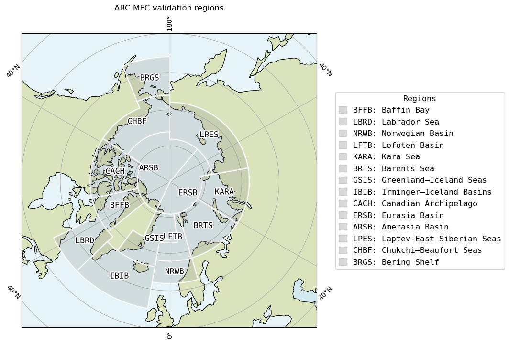
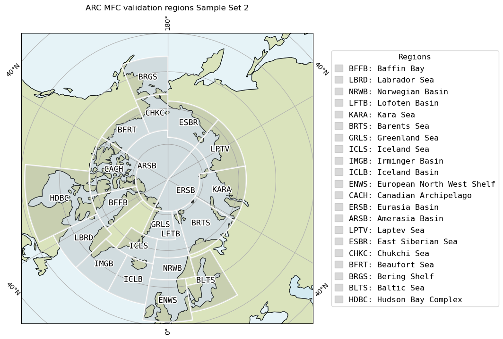
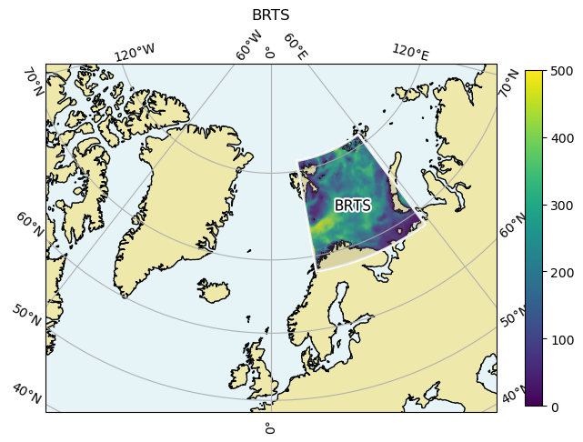

# ARCMFC_BGC_validation_regions
Common validation regions for ARC MFC BGC products regional validation

Jupyter notebook `def_validation_regions.ipynb` for designing your own regional masks. This notebook is for complimenting NERSC-HYCOM-CICE BGC validation tool on NERSC github repository:

[bgc.validation](https://github.com/nansencenter/NERSC-HYCOM-CICE/tree/bgc_validation_folder/bin/bgc.validation)

Main functions provided here are:

- Custom designing of model validation regions:

- Creation of mask file compatible with `make_OM_regional_masks.py` -saved mask file
- Creation of mask file useful for generating Polygon data for each validation region
- Subsetting model variable using mask file:

For further detail, see the notebook.
